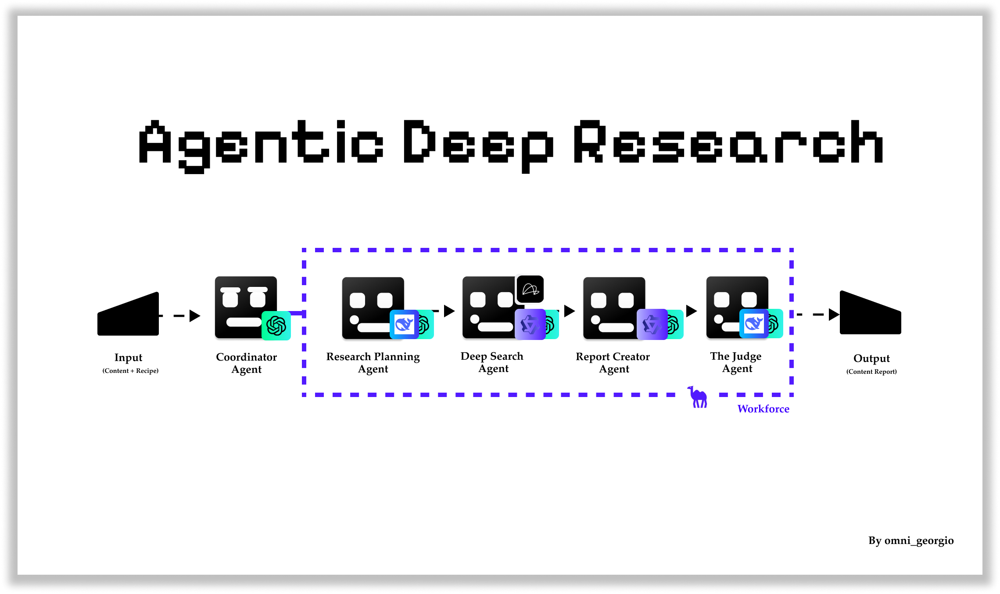

# Deep Research Team

A multi-agent AI research system designed to know what it knows (and doesn't know) when conducting research and creating content.

## The Vision

Currently, AI research agents have significant limitations - they often make assumptions, fabricate information, or miss crucial context. This project was heavily inspired by the groundbreaking work in ["TICKing All the Boxes: Generated Checklists Improve LLM Evaluation and Generation"](https://arxiv.org/abs/2410.03608) by Cook et al., which demonstrated how structured checklists can significantly improve LLM evaluation and generation quality.

This might seem like a small thing within research, but if you really think about it, this is the start of something much bigger. If the agents can understand what they don't know—just like a human—they can reason about what they need to learn. This has the potential to make the process of agents acquiring information much, much faster and in turn being much smarter.

## System Architecture



## How It Works

The system operates through 5 key components:

### 1. Recipes
Think of these as detailed instructions for the research process. While currently manual, future versions will aim to automate recipe generation. Recipes specify:
- Required information ("ingredients")
- Output format
- Example outputs
- Research parameters

### 2. Research Intelligence Planning Agent
The first step in our research pipeline:
- Analyzes input content against recipe requirements
- Maps known vs unknown information
- Creates structured research plans
- Identifies which gaps can be filled through research

### 3. Deep Search Agent
Our dedicated researcher:
- Executes research plans
- Uses Google search strategically
- Verifies information from multiple sources
- Documents findings and confidence levels

### 4. Report Creator Agent
Our content synthesizer:
- Combines original content with research findings
- Follows recipe format requirements
- Maintains clear sourcing
- Highlights any remaining uncertainties

### 5. The Judge Agent
Our final quality check:
- Evaluates output completeness
- Checks adherence to recipe
- Validates information accuracy
- Provides detailed quality metrics

## Prerequisites

- Python 3.8+
- OpenAI API key
- Anthropic API key
- Google API key
- Google Search Engine ID

## Installation

1. Clone the repository
2. Install required dependencies:
```bash
pip install -r requirements.txt
```

3. Create a `.env` file with your API keys:
```bash
OPENAI_API_KEY=your_openai_key
ANTHROPIC_API_KEY=your_anthropic_key
GOOGLE_API_KEY=your_google_key
SEARCH_ENGINE_ID=your_search_engine_id
```

## Usage

### Basic Input Format

The tool accepts two main inputs:

```python
{
    "content": "", # Content to be researched/analyzed
    "recipe_id": "23634687939724" # Optional recipe ID from database
}
```

### Recipe Structure

When using a recipe ID, the following data structure is retrieved:

```python
{
    "recipe": "Format instructions for the output",
    "examples": "Example outputs showing desired format",
    "ingredients": "List of required information to include",
    "needs_research": "TRUE/FALSE" # Whether additional research is needed
}
```

### How It Works

1. **Research Intelligence Planning Phase**
   - The Content Research Planner Agent analyzes the input content
   - Identifies missing information and research needs
   - Creates a structured research plan

2. **Deep Search Phase**
   - The Deep Search Agent performs targeted searches using Google
   - Verifies facts and gathers additional context
   - Documents findings and sources

3. **Report Creation Phase**
   - Report Creator Agent synthesizes all information
   - Follows specified recipe format
   - Ensures all required ingredients are covered

4. **Judgment Phase**
   - The Judge Agent evaluates the output
   - Checks completeness and accuracy
   - Provides quality scores and recommendations

### Example Output

```python
{
    "overall_assessment": "PASS",
    "score": "9/10",
    "report": {
        "overview": "...",
        "technical_details": "...",
        "benefits": "...",
        "additional_context": "..."
    },
    "quality_metrics": {
        "completeness": "9/10",
        "format_adherence": "10/10",
        "information_quality": "8/10"
    }
}
```

## The Bigger Picture

While this might seem like a focused solution for research tasks, it represents something much more significant. By creating agents that understand their knowledge boundaries - just like humans do - we're taking a step toward more reliable AI systems.

The ability to reason about what they don't know and need to learn could dramatically improve how AI systems:
- Acquire new information
- Validate their knowledge
- Make reliable decisions
- Learn continuously

## Current Limitations

It's important to note that this is v0, and there are known limitations:
- Research quality varies by topic
- Some context nuances may be missed
- Recipe creation requires manual input
- Search capabilities are constrained by available APIs

## Future Directions

Planned improvements include:
- Automated recipe generation
- Enhanced source validation
- Expanded search capabilities
- Better context understanding
- More sophisticated knowledge mapping

## Configuration

The tool uses several AI agents, each configurable through environment variables:
- Content Research Planner Agent
- Research Agent
- Report Creator Agent
- Report Quality Judge Agent

## Contributing

1. Fork the repository
2. Create your feature branch
3. Submit a pull request

## License

MIT License

## Support & Community

This is an evolving project, and community input is valuable. For support:
- Open an issue for bugs/features
- Join our discussions for ideas
- Share your use cases and feedback

Let's work together to make AI research more reliable and self-aware.
